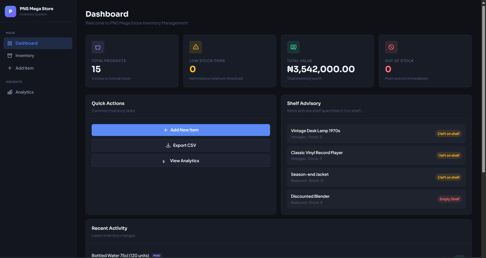
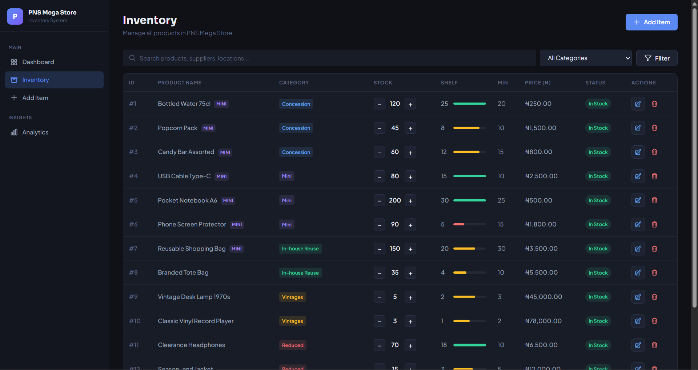
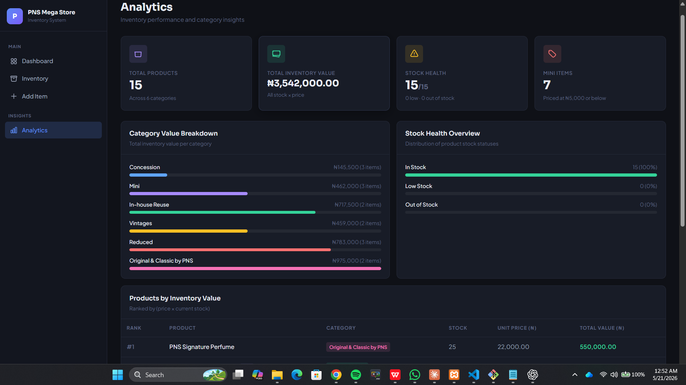

# PNS Mega Store — Inventory Management System

A full-stack web application for managing retail inventory, 
built with PHP, MySQL, and vanilla JavaScript as a team project.

## Features
- Dashboard with live metrics (total products, stock value, alerts)
- Full inventory CRUD (add, edit, delete products)
- Real-time stock adjustment via AJAX (no page reload)
- Search and category filtering
- Shelf advisory alerts for low shelf quantities
- Analytics page with category breakdowns and value rankings
- CSV export with Excel compatibility (UTF-8 BOM)
- Fully responsive — mobile and desktop

## My Contributions
- Designed and built the entire frontend (HTML, CSS, JavaScript)
- Created the responsive sidebar and mobile navigation
- Built the real-time stock adjuster using the Fetch API (AJAX)
- Designed the dark-theme UI including metric cards, tables, 
  badges,shelf indicators, and category color system
- Implemented all flash messages, form layouts, and animations

## Team Contributions
- Backend logic: PHP (CRUD, authentication, CSV export)
- Database design: MySQL schema and seed data
- also contributed to the javascript

## Tech Stack
- **Frontend:** HTML5, CSS3, Vanilla JavaScript (Fetch API)
- **Backend:** PHP 8, MySQLi (teammate)
- **Database:** MySQL (teammate)

## Setup
1. Import `database/pns_megastore.sql` into MySQL
2. Copy `includes/db.example.php` → `includes/db.php` and fill in credentials
3. Place project in `htdocs/` and visit `http://localhost/pns_megastore/`

## Screenshots

##Dashbaord

##Inventory

##Analytics

